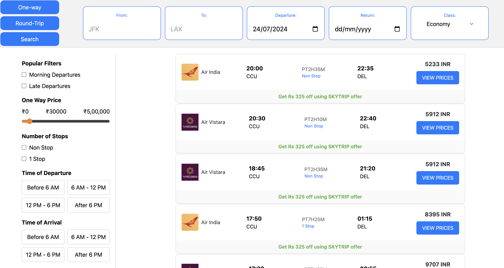
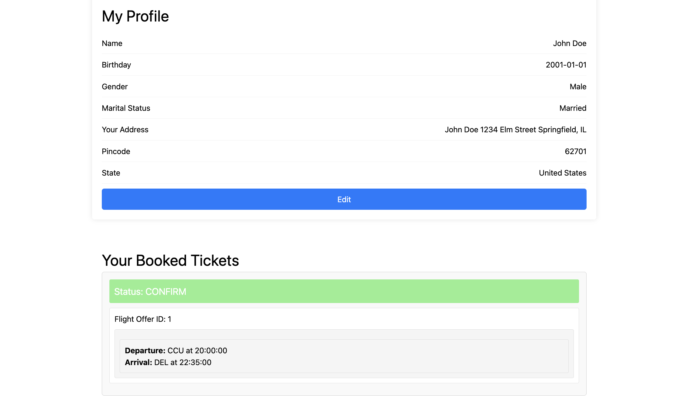
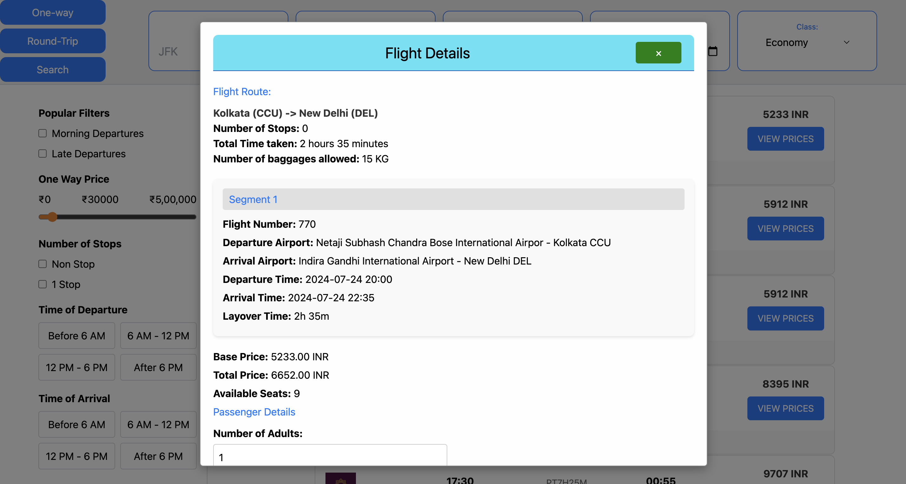
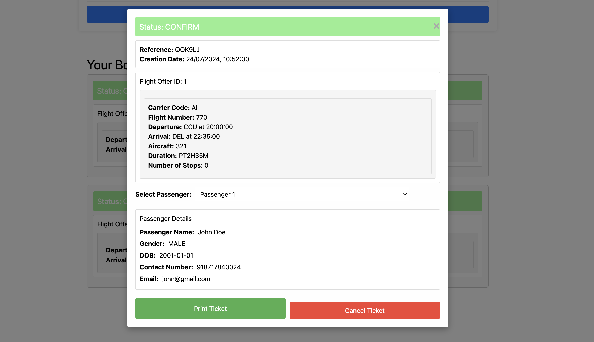

# Airline Management 

A complete flight booking website made using MERN Stack (MongoDB, Express js, React js, Node js)

The Flight ticket booking  webstite is composed of the following Features:


## Features

- User Authentication: Users can sign in and sign up, ensuring only registered users can access the website.
- Profile Page: Displays all information about the signed-in user.
- Users can choose starting and destination cities by typing a few letters to get airport suggestions. 
- Flight Listings: Retrieves a list of flights from different airlines with various details.
- Ticket Confirmation: Booked tickets are shown in the ticket history on the profile page, and users can also cancel them.
- Cross-Platform and Cross-Device Compatibility: The application is designed to be accessible and fully functional on multiple platforms (e.g., web, mobile,tablets).


## Sign In Page


## search Page



## Profile Page



## Flight Details



## Booked details



---

## Developed With

* [Visual Studio Code](https://code.visualstudio.com/) - A versatile source code editor developed by Microsoft, supporting Windows, Linux, and macOS. It offers features like debugging, Git integration, syntax highlighting, intelligent code completion, snippets, and code refactoring.
* [Node.js](https://nodejs.org/en/) - A powerful JavaScript runtime environment(version 20.x)
* [React](https://reactjs.org/) - A popular JavaScript library for building user interfaces.
* [tailwind](https://tailwindcss.com/) - A utility-first CSS framework for creating custom user interfaces rapidly
* [Axios](https://github.com/axios/axios) - Promise based HTTP client for the browser and node.js
* [Express js](http://expressjs.com/) - Express is a minimal and flexible Node.js web application framework that provides a robust set of features for web and mobile applications.
* [MongoDB atlas](https://www.mongodb.com/cloud/atlas) - MongoDB Atlas is the global cloud database service for modern applications.
---

## Run Locally

Clone the project

```bash
  git clone https://github.com/Vishnu-Shakya/AirLine-Management.git
```

Go to the project directory

```bash
  cd AirLine-Management
```

Install dependencies

Client-Side Usage (PORT: 5178)
```bash
  cd client                     # Navigate to the client folder
  npm install                   # Install the necessary packages
  npm run dev -- --mode development    # Run the server locally
  npm run dev -- --mode production   
```

Server-Side Usage (PORT: 3000)
```bash
   cd server           # Navigate to the client folder
   npm install         # Install the necessary packages 
   node index.js       # Run Server 
```

## Authors

- [@Yash-Jain](https://github.com/yash-jainn)
- [@Vishnu-Shakya](https://github.com/Vishnu-Shakya)
- [@Surankan-De](https://github.com/surankan-de)


